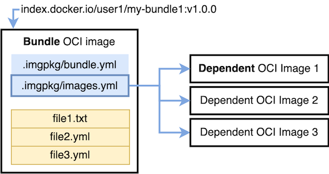

# Documentation

## What is imgpkg

`imgpkg` is a tool that allows users to store a set of arbitrary files as an OCI image. One of the driving use cases is to store Kubernetes configuration (plain YAML, ytt templates, Helm templates, etc.) in OCI registry as an image.

Primary concept imgpkg introduces is a [bundle](resources.md#Bundle) which is an OCI image that holds 0+ arbitrary files and 0+ references to dependent OCI images. This allows imgpkg to copy bundles and their dependent images across registries (online and offline).

## Example Workflows

- [Basic workflow](basic-workflow.md) shows how to create, push and pull bundles by taking simple Kubernetes application
- [Air-gapped workflow](air-gapped-workflow.md) shows how to copy bundles from one registry to another to enable running Kubernetes application without relience on external registries

### Reference

- [Authentication to registry](auth.md)
- [Resources](resources.md) describes concepts and data formats

## Commands

`imgpkg` supports four commands:
- [`push`](commands.md#push) a bundle from local directory to a registry. 
- [`pull`](commands.md#pull) a bundle by retrieving it from a registry.
- [`copy`](commands.md#copy) a bundle from a registry or tarball to another registry or tarball.
- [`tag`](commands.md#tag) currently supports listing pushed image tags.
